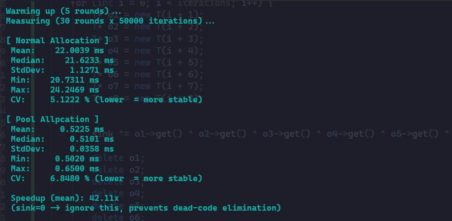

# 🧠 C++ Memory Pool (MemPool)

A fast, lightweight **fixed-size memory pool** allocator in C++. Instead of making expensive system calls for every `new`/`delete`, this pool pre-allocates a large block of memory upfront and manages it internally using a **free list** — giving you blazing-fast allocation and deallocation.

---

## 🚀 Benchmark

> Pool allocation was **~42× faster** than standard heap allocation in statistically modelled testing.



Benchmarked with **30 rounds × 50,000 iterations** (interleaved, with 5 warmup rounds) to eliminate cache cold-start bias, compiler dead-code elimination, and OS scheduling noise.

| Metric | Normal `new`/`delete` | Memory Pool |
|---|---|---|
| Mean | 22.00 ms | 0.52 ms |
| Median | 21.62 ms | 0.51 ms |
| StdDev | 1.13 ms | 0.036 ms |
| Min | 20.73 ms | 0.50 ms |
| Max | 24.25 ms | 0.65 ms |
| CV | 5.12% | 6.85% |
| **Speedup** | — | **~42×** |

The distributions don't overlap at all — pool max (0.65 ms) vs normal min (20.73 ms) — making the speedup **statistically unambiguous**. The pool's slightly higher CV is expected: when measurements are sub-millisecond, timer resolution itself becomes a source of relative noise.

---

## 📁 Project Structure

```
MemPool/
├── MemPool.h       # MemoryManager class declaration
├── MemPool.cpp     # Pool implementation
└── main.cpp        # Statistical benchmark (30 rounds, warmup, CV analysis)
```

---

## ⚙️ How It Works

### The Core Idea

Standard `new`/`delete` is slow because it talks to the OS every single time to find free heap space. A **memory pool** solves this by:

1. Allocating one large contiguous block of memory upfront.
2. Slicing it into fixed-size chunks.
3. Maintaining a **free list** — a singly linked list of available chunks.
4. On `Allocate()`: pop a chunk off the front of the list.
5. On `Deallocate()`: push the chunk back onto the front of the list.

No OS calls. No fragmentation. Just pointer manipulation.

---

### Block Diagram

```
Initial Pool (Amount = 5 chunks, each of ChunkSize bytes)
─────────────────────────────────────────────────────────

memory_
  │
  ▼
┌──────────┬──────────┬──────────┬──────────┬──────────┐
│ Chunk 0  │ Chunk 1  │ Chunk 2  │ Chunk 3  │ Chunk 4  │
│ [ptr]────┼──►[ptr]──┼──►[ptr]──┼──►[ptr]──┼──►[NULL] │
└──────────┴──────────┴──────────┴──────────┴──────────┘
  ▲
  │
freeListHead_

Each chunk stores a pointer to the NEXT free chunk inside its own memory.
```

---

### After `Allocate()` is called twice

```
freeListHead_ now points to Chunk 2

┌──────────┬──────────┬──────────┬──────────┬──────────┐
│ Chunk 0  │ Chunk 1  │ Chunk 2  │ Chunk 3  │ Chunk 4  │
│ [IN USE] │ [IN USE] │ [ptr]────┼──►[ptr]──┼──►[NULL] │
└──────────┴──────────┴──────────┴──────────┴──────────┘
                         ▲
                         │
                   freeListHead_
```

---

### After `Deallocate(Chunk 0)` is called

```
Chunk 0 is pushed back to the front of the free list

┌──────────┬──────────┬──────────┬──────────┬──────────┐
│ Chunk 0  │ Chunk 1  │ Chunk 2  │ Chunk 3  │ Chunk 4  │
│ [ptr]────┼──────────┼──►[ptr]──┼──►[ptr]──┼──►[NULL] │
└──────────┴──────────┴──────────┴──────────┴──────────┘
  ▲           [IN USE]
  │
freeListHead_

Chunk 0's first bytes now store a pointer to the old head (Chunk 2).
```

---

## 🔧 API

### `MemoryManager(size_t ObjectSize, size_t Amount)`
Creates a pool of `Amount` chunks, each large enough to hold an object of `ObjectSize` bytes.

```cpp
MemoryManager pool(sizeof(MyClass), 100); // Pool for 100 MyClass objects
```

### `void* Allocate()`
Returns a pointer to a free chunk. Returns `nullptr` if the pool is exhausted.

### `void Deallocate(void* ptr)`
Returns the chunk at `ptr` back to the pool. O(1) operation.

---

## 💡 Usage Example

### Minimal Example

```cpp
#include "MemPool.h"
#include <iostream>

struct Vec3 {
    float x, y, z;
};

int main() {
    // Create a pool for 10 Vec3 objects
    MemoryManager pool(sizeof(Vec3), 10);

    // Allocate a chunk and placement-new the object into it
    void* mem = pool.Allocate();
    Vec3* v = new(mem) Vec3{1.0f, 2.0f, 3.0f};

    std::cout << v->x << ", " << v->y << ", " << v->z << "\n"; // 1, 2, 3

    // Destroy the object and return memory to the pool
    v->~Vec3();
    pool.Deallocate(v);

    return 0;
}
```

### Overloading `new`/`delete` (Recommended Pattern)

```cpp
#include "MemPool.h"

class Bullet {
    float x, y, speed;

public:
    Bullet(float x, float y, float speed) : x(x), y(y), speed(speed) {}

    // Hook into the pool automatically via operator new/delete
    void* operator new(size_t size) {
        return pool.Allocate();
    }

    void operator delete(void* ptr) {
        pool.Deallocate(ptr);
    }

    static MemoryManager pool;
};

// Initialize the static pool (e.g. 200 bullets max)
MemoryManager Bullet::pool(sizeof(Bullet), 200);

int main() {
    // These now use the pool — no expensive heap calls!
    Bullet* b1 = new Bullet(0.0f, 0.0f, 10.0f);
    Bullet* b2 = new Bullet(5.0f, 3.0f, 15.0f);

    delete b1; // Returns to pool, not OS
    delete b2;

    return 0;
}
```

---

## 🏗️ Implementation Details

### Constructor — Building the Free List

```cpp
MemoryManager::MemoryManager(size_t ObjectSize, size_t Amount) {
    // Each chunk must be at least sizeof(void*) to store the next pointer
    chunkSize_ = std::max(ObjectSize, sizeof(void*));

    memory_ = new char[chunkSize_ * Amount]; // One big block

    // Link chunks into a singly linked list
    freeListHead_ = memory_;
    char* current = memory_;

    for (size_t i = 0; i < Amount - 1; i++) {
        char* next = current + chunkSize_;
        *reinterpret_cast<void**>(current) = next; // Store next ptr in current chunk
        current = next;
    }

    *reinterpret_cast<void**>(current) = nullptr; // Last chunk → null
}
```

### Allocate — Pop from Free List

```cpp
void* MemoryManager::Allocate() {
    if (!freeListHead_) return nullptr; // Pool exhausted

    void* chunk = freeListHead_;
    freeListHead_ = *reinterpret_cast<void**>(chunk); // Advance head
    return chunk;
}
```

### Deallocate — Push to Free List

```cpp
void MemoryManager::Deallocate(void* ptr) {
    if (!ptr) return;

    *reinterpret_cast<void**>(ptr) = freeListHead_; // Point returned chunk to old head
    freeListHead_ = ptr;                             // New head = returned chunk
}
```

---

## ⚠️ Limitations & Planned Improvements

- **Fixed-size only** — all objects in a pool must be the same size.
- **Pool exhaustion** — currently returns `nullptr`; automatic pool expansion is planned.
- **Not thread-safe** — concurrent `Allocate`/`Deallocate` calls require external locking.
- **No bounds checking** — deallocating a pointer not belonging to the pool is undefined behavior.

---

## 🛠️ Building

**Visual Studio (recommended)**
Open the project, set configuration to **Release** (`Ctrl+F5`), ensure `/O2` optimization is on under Project Properties → C/C++ → Optimization. Debug mode adds heap instrumentation that skews normal allocation results.

**GCC / Clang**
```bash
g++ -O2 -std=c++17 main.cpp MemPool.cpp -o mempool
./mempool
```

---

## 📜 License

MIT License — free to use and modify.
