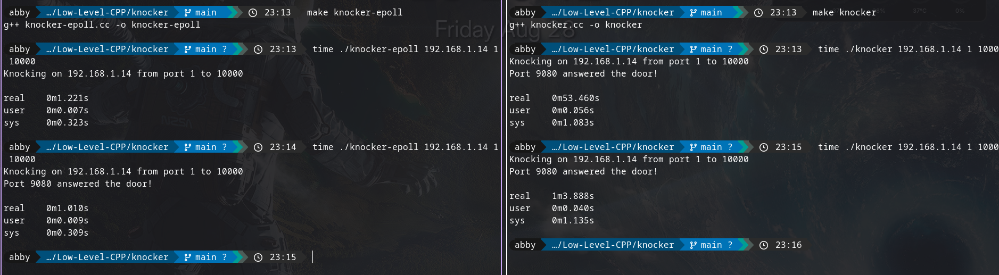

# Knocker 🚪‼️ 

A simple single threaded blocking TCP port scanner made in C++ which knocks at each port's door in the specified range of ports defined by the user.
I can hear it say "I am the one who knocks".

This is a project I am working on while I'm still learning stuff, so expect many wrong things in here but not totally wrong.
You are most welcome to contdibute and correct things out :)

## What are these different versions and why so many of them?
I've made different versions of the same port scanner, each one impose some problems and solve the ones introduced by previous one.

1. `knocker` : A simple and naive ports scanner that is good for the localhost but you will see it lacking behing when you introduce real network latency.
               Made with simple socket programming and no concurrency approach at all.

2. `knocker-epoll` : I didn't use a Thread-pool as many concurrent implementation do because why would you bother yourself with multithreading when you have got I/O bound operations?
                    Used epoll and event loops to fire 500 non-blocking connection attempts and let the kernel notify us when they resolve.

3. `knocker-epoll-timer` : Although I don't advice to use port scanner in any site without their permissions due to some [legal reasons](https://cybernews.com/editorial/port-scanning-legality-explained/), the site's firewall might drop the unexpected packets instead of rejecting them. As a result, the scanner will hang for responses that are never coming. So, I implemented a custom timer handling using `timerfd`.

#### Some really cool and important thinking on this one
But, what's wrong in the 3rd implementation?
STL's unordered hashmap is not a bad structure but thinking about some Data Oriented Design, this might not be the perfect one for file decriptors and time stamps. That said, an unordered_map hashes the int (a wasted no-op, since the int is already a good index), deals with bucket chains, causes pointer-chasing on every lookup, and allocates nodes on the heap that are scattered in memory, which is hostile to the cache. We're paying hashmap overhead to simulate what an array gives us natively. 
The sweep in previous version takes O(N) for single timer tick, checking sockets that have no chance of having timed out yet (a socket that connected 50ms ago obviously isn't past a 2000ms timeout). The new idea is that: *if every connection has the same fixed timeout duration, and we insert connections in the order they arrive, then the list is automatically sorted by expiration time.*

4. `knocker-intrusive` : Uses an intrusive data structure of Connection's struct. The "intrusive" part is just that next/prev live inside Connection rather than in some side structure. The whole array and Connections structure follow these two principls: **insert at tail** and **unlink from anywhere**. To see the whole engineering it took for me, check out the implementation's code. If you have some other better optimizations and suggestions then you're most welcome to point them out and even contribute to this :>

5. `knocker-io_uring` : (to be implemented)

## Usage of knocker
1. run `make kncoker`
2. run `./knocker <ip-address> <port-start> <port-end>`

for eg. `./knocker 127.0.0.1 1 1000` will scan for ports from 0 to 1000 in the local host.

## Usage of knocker-epoll
1. run `make knocker-epoll`
2. run `./knocker-epoll <ip-address> <port-start> <port-end>`

## Usage of knocker-epoll-timer
1. run `make knocker-epoll-timer`
2. run `./knocker-epoll-timer <ip-address> <port-start> <port-end>`

### Note for the epoll one (and all those which are not the simple and naive implementations)
If you try to compare the simple and epoll ones on local-host then you will definitely see that simple one out-performs epoll one.
To see the real power of epoll one, use and compare them for an actual network latency.
The easiest way to introduce that is by connecting your PC and phone to the same Wi-Fi network and then putting the ip-address of that network.
To see the ip address of the network in your android phone, refer [this](https://www.pttrns.com/what-is-my-wifi-ip-address-on-android/).

This is how it turned out for me...

